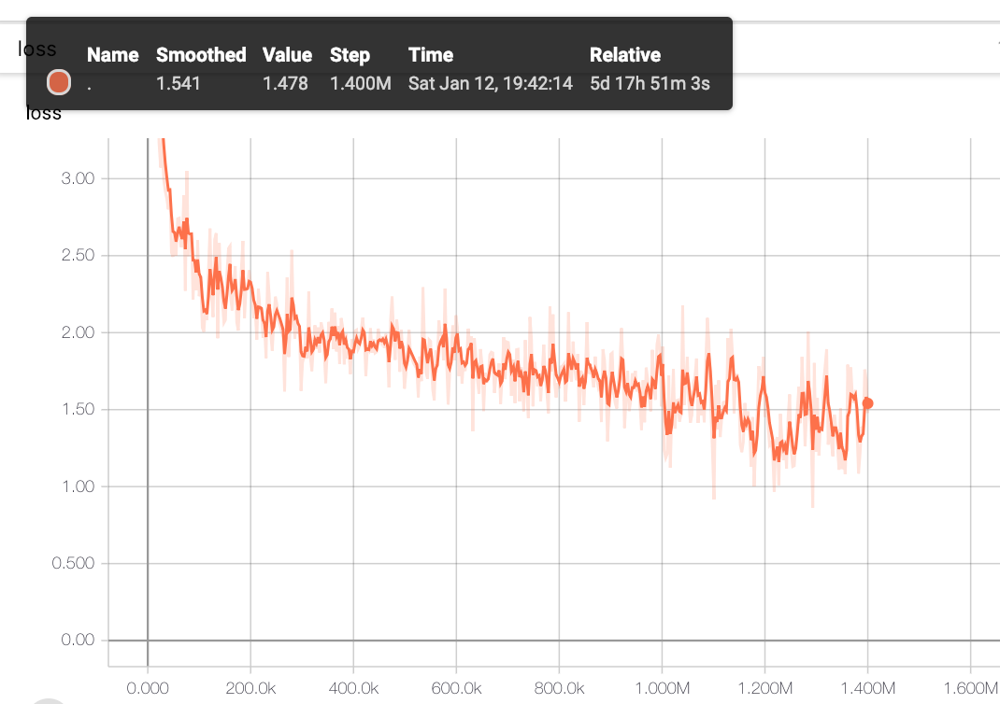

# BERT with SentencePiece for Japanese text.
This is a repository of Japanese BERT model with SentencePiece tokenizer  
forked from https://github.com/yoheikikuta/bert-japanese .

## Current changes
- appended optimization.py and modeling.py from original bert repo.
- ld_corpus.py: a script to download data and to test finetuned model.

## Usage ld_corpus.py
Suppose that current directory is repository root.

```:bash
#
# Download
python src/ld_corpus.py -m fetch
# According to TRAIN_PROPS in config.ini in this version
# train data with proportion 0.05, 0.10, 0.20, 0.50, 1.00 
# (to the rest samples of vaild and train) will be created in data/livedoor
ls data/livedoor/
# prop_0p05  prop_0p10  prop_0p20  prop_0p50  prop_1p00  text
# Note: test.tsv, dev.tsv in prop_x are the same each other
#
# Train
python src/run_classifier.py \
  --task_name=livedoor \
  --do_train=true \
  --do_eval=true \
  --data_dir=data/livedoor/prop_1p00 \
  --model_file=model/wiki-ja.model \
  --vocab_file=model/wiki-ja.vocab \
  --init_checkpoint=model/model.ckpt-1400000 \
  --max_seq_length=512 \
  --train_batch_size=4 \
  --learning_rate=2e-5 \
  --num_train_epochs=10 \
  --output_dir=model/livedoor_model_normal_1p00_1
#
# Test
python src/ld_corpus.py -m test \
  -p model/livedoor_model_normal_1p00_1 \ 
  -d data/livedoor/prop_1p00
# (output example)
# ***** RESULT *****
# Test dataset:
# data/livedoor/prop_1p00/test.tsv
# Tested model:
# model/livedoor_model_normal_1p00_1/model.ckpt-11052
# Accuracy:
# 0.9572301425661914
# Detailed report:
#                 precision    recall  f1-score   support
# 
# dokujo-tsushin       0.96      0.91      0.93       178
# ...
# 
# Confusion matrix:
# [[162   1   0   5   1   9   0   0   0]
# ...
```

## Pretrained models
We provide pretrained BERT model and trained SentencePiece model for Japanese text.
Training data is the Japanese wikipedia corpus from [`Wikimedia Downloads`](https://dumps.wikimedia.org/).  
Please download all objects in the following google drive to `model/` directory.
- **[`Pretrained BERT model and trained SentencePiece model`](https://drive.google.com/drive/folders/1Zsm9DD40lrUVu6iAnIuTH2ODIkh-WM-O?usp=sharing)** 

Loss function during training is as below (after 1M steps the loss function massively changes because `max_seq_length` is changed from `128` to `512`.):


```
***** Eval results *****
  global_step = 1400000
  loss = 1.3773012
  masked_lm_accuracy = 0.6810424
  masked_lm_loss = 1.4216621
  next_sentence_accuracy = 0.985
  next_sentence_loss = 0.059553143
```

## Finetuning with BERT Japanese
We also provide a simple Japanese text classification problem with [`livedoor ニュースコーパス`](https://www.rondhuit.com/download.html).  
Try the following notebook to check the usability of finetuning.  
You can run the notebook on CPU (too slow) or GPU/TPU environments.
- **[finetune-to-livedoor-corpus.ipynb](https://github.com/yoheikikuta/bert-japanese/blob/master/notebook/finetune-to-livedoor-corpus.ipynb)**

The results are the following:
- BERT with SentencePiece
  ```
                  precision    recall  f1-score   support

  dokujo-tsushin       0.98      0.94      0.96       178
    it-life-hack       0.96      0.97      0.96       172
   kaden-channel       0.99      0.98      0.99       176
  livedoor-homme       0.98      0.88      0.93        95
     movie-enter       0.96      0.99      0.98       158
          peachy       0.94      0.98      0.96       174
            smax       0.98      0.99      0.99       167
    sports-watch       0.98      1.00      0.99       190
      topic-news       0.99      0.98      0.98       163

       micro avg       0.97      0.97      0.97      1473
       macro avg       0.97      0.97      0.97      1473
    weighted avg       0.97      0.97      0.97      1473
  ```
- sklearn GradientBoostingClassifier with MeCab
  ```
                    precision    recall  f1-score   support

  dokujo-tsushin       0.89      0.86      0.88       178
    it-life-hack       0.91      0.90      0.91       172
   kaden-channel       0.90      0.94      0.92       176
  livedoor-homme       0.79      0.74      0.76        95
     movie-enter       0.93      0.96      0.95       158
          peachy       0.87      0.92      0.89       174
            smax       0.99      1.00      1.00       167
    sports-watch       0.93      0.98      0.96       190
      topic-news       0.96      0.86      0.91       163

       micro avg       0.92      0.92      0.92      1473
       macro avg       0.91      0.91      0.91      1473
    weighted avg       0.92      0.92      0.91      1473
  ```


## Pretraining from scratch
All scripts for pretraining from scratch are provided.
Follow the instructions below.

### Environment set up
Build a docker image with Dockerfile and create a docker container.

### Data preparation
Data downloading and preprocessing.
It takes about one hour on GCP n1-standard-8 (8CPUs, 30GB memories) instance.

```
python3 src/data-download-and-extract.py
bash src/file-preprocessing.sh
```

### Training SentencePiece model
Train a SentencePiece model using the preprocessed data.
It takes about two hours on the instance.

```
python3 src/train-sentencepiece.py
```

### Creating data for pretraining
Create .tfrecord files for pretraining.
For longer sentence data, replace the value of `max_seq_length` with `512`.

```
for DIR in $( find /work/data/wiki/ -mindepth 1 -type d ); do 
  python3 src/create_pretraining_data.py \
    --input_file=${DIR}/all.txt \
    --output_file=${DIR}/all-maxseq128.tfrecord \
    --model_file=./model/wiki-ja.model \
    --vocab_file=./model/wiki-ja.vocab \
    --do_lower_case=True \
    --max_seq_length=128 \
    --max_predictions_per_seq=20 \
    --masked_lm_prob=0.15 \
    --random_seed=12345 \
    --dupe_factor=5
done
```

### Pretraining
You need GPU/TPU environment to pretrain a BERT model.  
The following notebook provides the link to Colab notebook where you can run the scripts with TPUs.

- **[pretraining.ipynb](https://github.com/yoheikikuta/bert-japanese/blob/master/notebook/pretraining.ipynb)**


## How to cite this work in papers
We didn't publish any paper about this work.  
Please cite this repository in publications as the following:

```
@misc{bertjapanese,
  author = {Yohei Kikuta},
  title = {BERT Pretrained model Trained On Japanese Wikipedia Articles},
  year = {2019},
  publisher = {GitHub},
  journal = {GitHub repository},
  howpublished = {\url{https://github.com/yoheikikuta/bert-japanese}},
}
```
